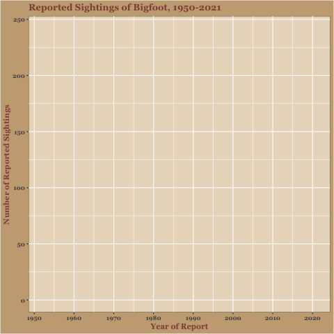

``` {r, setup, include = F, eval = T}
packages <- c("tidyverse", "reshape2", "fauxnaif", "gganimate", "ggthemes",
              "stringr", "gridExtra", "gifski", "png", "ggrepel", "scales",
              "lubridate", "paletteer", "GGally", "systemfonts", "extrafont",
              "colorspace", "sf", "rnaturalearth", "ggmap",
              "rnaturalearthdata", "paletteer", "stringr", "haven",
              "plotly", "ggridges")

lapply(packages, require, character.only = TRUE)

```
# Exercises Feed

These exercises will be ungraded opportunities for you to continue to build your R skills. If you spend about 45 min to 1 hour on these skills weekly, you'll find your abilities will improve dramatically very quickly.

[Week 1](01_exercise.html)

[Week 2](02_exercise.html)

[Week 3](03_exercise.html)

[Week 4](04_exercise.html)

[Animation!](gganimate_tutorial.R)

And here I have embedded the animated visualization: 

 


Here is an interactive plot created with the `plotly` package: 

```{r, include = T, eval=T, results = "asis"}
library(vdemdata)

vdem %>% 
  filter(year == 2020, !is.na(v2x_regime), !is.na(e_v2x_gender_4C))%>%
  group_by(v2x_regime, e_v2x_gender_4C) %>%
  count() %>%
  ggplot(aes(x = v2x_regime, y = , e_v2x_gender_4C, fill = n))+
  geom_tile() -> gender_regime

ggplotly(gender_regime)-> gender_plotly

gender_plotly
```