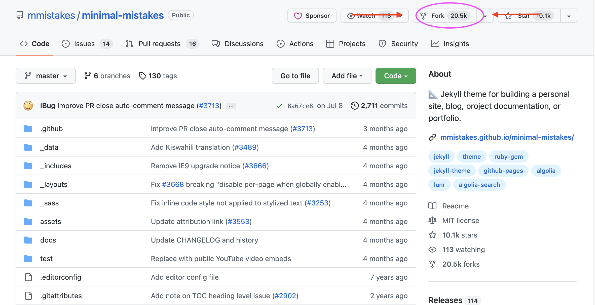
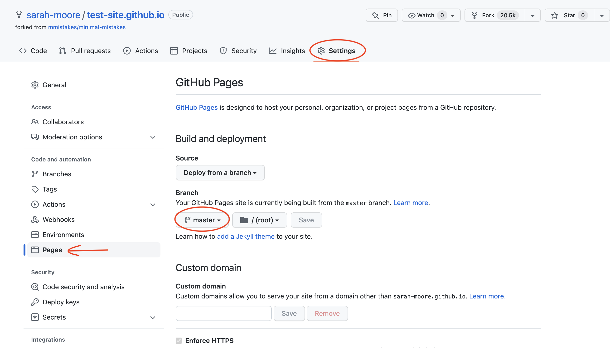
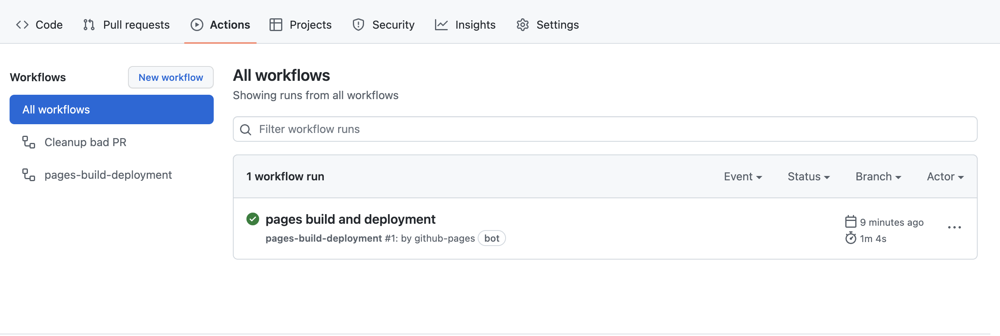
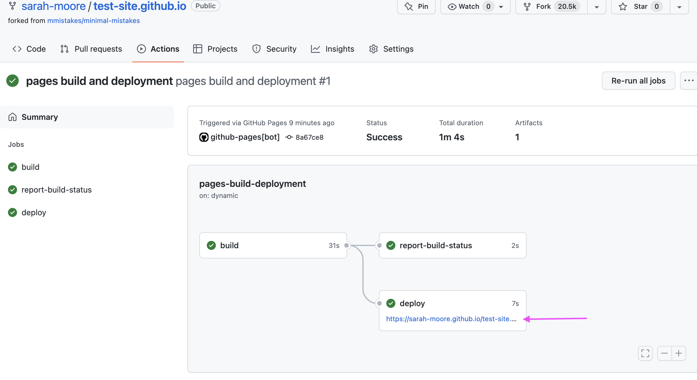

# A little rundown on GitHub Pages + Jekyll Themes 

This guide will help you get set up on GitHub pages. 

This build is in the case that you want to create a personal website. 

In each of these options, I have assumed that you want to use GitHub pages because you want something that is customizable, elegant, but limited backend development on your end. To that point, you will first need to find a **Theme** that you want for your site. GitHub pages uses *Jekyll* to facilitate the CSS and html portions of the gh page design. There are many complicated ways to get into this, but here I'll try to go through the minimally intensive routes if you are just interested in getting a site up and running. 

I've also assumed that you, at a minimum, have a GitHub account. If this is not the case, then we need to take a few steps back and do that. Furthermore, if you want to integrate this in a *local workflow* on your own computer, you'll need to ensure that you have Git and GitHub Desktop downloaded. This is more complicated and I recommend that you just look up how to do this based on your home operating system. 

To find a free Jekyll theme you can head to [this link.](https://jekyllthemes.io/free) Based on the theme you choose, you have a couple of options. Option 1 is probably easiest and most likely and Option 2 might be good if you find a theme that you can't fork directly from. 

*Note*: In some cases, the developers of a Jekyll theme have also deployed a template for you to just start on right away. This will be something like a *remote access* or something like that. That will be easier than the steps that follow. BUT is not always available. 

## Option 1: Fork a theme and then customize 

So you find a theme that works particularly well for your needs. The easiest case is that theme is already housed for free on a GitHub repository out there. Here are the steps to publishing that theme as *your own* gh page. 

1) Let's say I wanted to choose the theme [_*Minimal Mistakes*_](https://jekyllthemes.io/theme/minimal-mistakes) from the free Jekyll theme site. I can click on that theme, which redirects me to the theme's [GH repo](https://github.com/mmistakes/minimal-mistakes). 

2) From this GH repo I can choose to **Fork** the repo. Forking a repo allows you to pull another contributor's repo content, as is, *as your own repository*, without it affecting the base repository. 

To fork a repo, simply click the **Fork** button on the top left-hand side of the page. I've pointed that out below. 

3) Once you click this button, you'll encounter a **Create a new fork** page. Here you'll need to make a repository name. To associate this with your GitHub directly, you need to name this repository `username.github.io`, where `username` is *your* GitHub username. For example, my website's repo is called `sarah-moore.github.io`. After you've done this just hit **Create fork**. 

4) Doing so will take you to the forked repo on your own GitHub. Once you get there the repo should be located under some path like: `username/username.github.io`. If you've gotten that far without problems, great! Now you'll go over to the **Settings** tab on the forked repo, and in the left-hand Settings menu you'll go to the **Pages** section. 

In this pages section you'll see where you have the opportunity to choose a source branch from which you'd like to publish the site. We'll make it easy and just change from *None* to *Master*. Then click **Save**. 

5) Now, you'll have to give it a second, but GH's backend will be working to publish your page! So, give it a second and you can see if this is working well or not if you visit the **Actions** tab in the working repository.

You can then click on that workflow to see the site's build process (especially helpful if you have to debug something) and then click on the published link. I've showed what this should look like below, my link is just a bit different because I already have a site at `sarah-moore.github.io`! 

Click that link and you can see the first publication of your working site. 

6) So obviously this site is customized to the extent that it is the build that you want BUT, nothing else is yours. First, I would suggest taking a look at the documentation included with the theme. This documentation will tell you what is what and how to customize the site to be *yours*. 

Everything will be sort of theme/site build dependent, but I'll go over some basic concepts.  

- You might also want to switch to the local version of the files at this point while you edit them. If that's the case, then you can go to GH Desktop, **Clone** the repo on to your local machine, and then edit the files as you please from there. Just remember for these changes to be reflected on the remote GH repo that you need to **Commit** and **Push** your local changes so that the site will build according to the changes you specified. 

- As another note, be sparing in what you delete from the site build. There may be dependencies required that you don't recognize in the repo. The Minimal Mistakes theme has included documentation regarding the necessary files to keep for the site to build. Many other themes will as well. So, until you are comfortable and confident in what you are doing in gh pages, I would just exercise caution as to what you get rid of! 

7)  Go back to the forked repo and find a file called `_config.yml`. Go to this page and look around before you edit it, try to get a feel for the information that might be included on here.

Some things that you ought to change are the `title`, `name`, `description`, `url`, and so on. Basically, if it *looks* like the information *you* should be providing, it's likely that you might be able to change it. Just remember that if you commit the change and it messes everything up, you can redo it in the repo history. 

8) Edit things and go back and forth as you can. At this point, it will be your laboratory for experimentation. If something doesn't make sense, try to explore the documentation a little more. If you're still stumped after that, ask me! Things will look a little different from site build to site build once you get to the option to add additional pages, tabs, or posts to your site. This is where the documentation will *especially* come in handy. As a hint, you'll want to look for a folder in the repo's code or in the documentation called `_posts` or `_pages`. This is where you will put individual `.md` files to create your individual assignment pages. 

## Option 2: Downloaded the Jekyll theme on to your local machine 

Alternatively to a forked repo you can _Download_ the theme code from the theme site that you are interested in and upload it as your own repo. This requires that you take the same naming conventions as above, where you name the repo `username.github.io`. (Unless you want it as a project page, which if you are to that point I think you probably already have enough skills in gh pages!!). You can then upload the pages files from your local version of your repository. 

For example, this is what I did with my site because I purchased my theme. I was then directed to a download center where I downloaded the Jekyll theme I chose, and then I created a repo and followed everything else from steps (4) onward of **Option 1.** 

 
