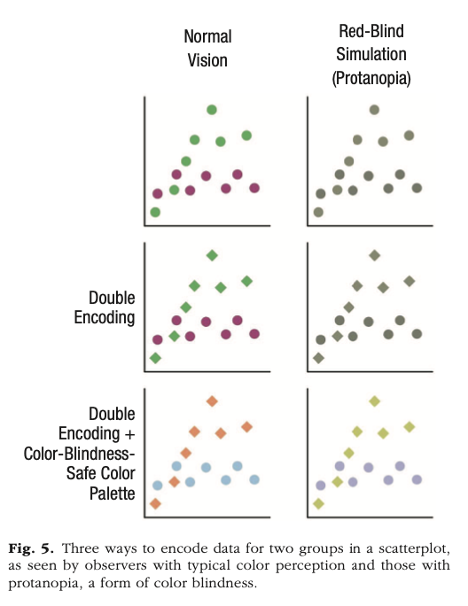
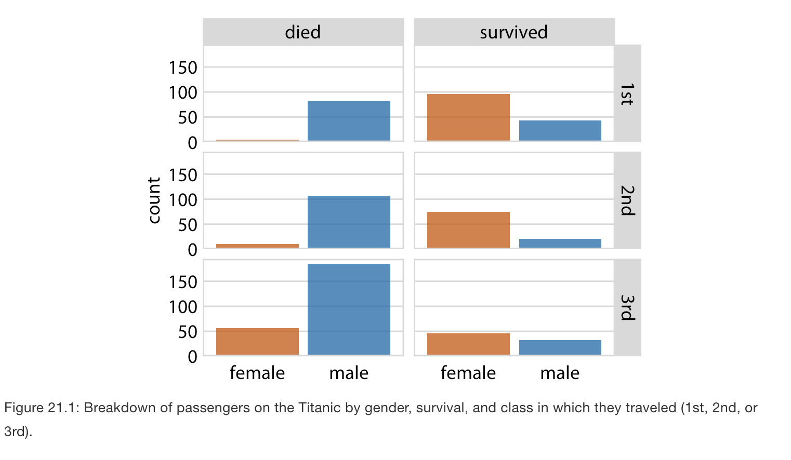

# Agenda for today 

- Last week we tried to think through some actual applied rules for mapping visualizations and when certain things work (or don't). 

- Now that we have some ground rules, we want to talk about how to make visualizations even more *user-friendly*. 

- These are the important considerations to take your visualizations from decent and readable to helpful and discernible. 

# Revisiting our directory\footnote{Adapted from Wilke ch. 5} 

\small 

\begin{table}
\centering
\begin{tabular}{|l|p{0.5\textwidth}|}
\hline 
\textbf{Type of Information} & \textbf{Suggested Visualization}\\ 
\hline
Amounts & bars, dots, heatmap \\
\hline 
Distributions & histogram, density plot, qq-plot, boxplot, violin plot, strip chart\\
\hline 
Proportions & bars, density plot, mosaiac plot, treemap, parallel set \\
\hline
Relations & scatterplot, bubblechart, slopegraph, contour plot, bins, correlogram, line graph \\
\hline
\end{tabular}
\end{table}

>- Each of these suggestions can be further modified to be inclusive of more information, by stacking, grouping, faceting, adding information on uncertainty, or changing coordinate systems. 

>- \color{purple}Under what circumstances do we need a **legend** or **labels** for each of these? Is there some sort of uniform need for either? 


# Really the answer is fuzzy 

- More than anything whatever we choose, we just need to rely on a technique that is effective and clear. 

- One way to ensure that we make things clear is through the concept of **redundant encoding.**

- **Redundant encoding ** uses various aesthetic mappings to iterate the information within a visualization. 

- This does not mean that we add more information over increased mappings, rather we maximize the opportunities for audience to understand the information being conveyed over different layers. 


# ---

- Therefore, the answer to better understanding isn't always about a **legend** or **labels**. Rather it's whatever solution we have to make something **redundant**. 

- Usually in coding (construed broadly), we don't want redundancy. We want *efficiency.* 

- **However**, our end goal is not super efficient code for visualization... It's an efficient and precise visualization task.

- Repetition is good for pattern finding, so if a pattern can be iterated multiple ways-- our audience benefits.

# Toy example of redundant coding 

```{r, eval = T, echo = F, message=FALSE}
library(tidyverse)
df <- rnorm(50, 0, 3)
df1 <- rnorm(50, 0, 1)
df2<- rbinom(50, 1, 0.8)

data1<- data.frame(df, df1, df2)

data1 %>%
  ggplot(aes(x = df, y = df1, color = as_factor(df2))) + 
  geom_jitter(size = 4)-> gg1

data1 %>%
  ggplot(aes(x = df, y = df1, shape = as_factor(df2))) + 
  geom_jitter(size = 4)-> gg2

data1 %>%
  ggplot(aes(x = df, y = df1,  color = as_factor(df2), shape = as_factor(df2))) + 
  geom_jitter(size = 4)-> gg3
```

# Color 
```{r, eval=T, echo = F}
gg1
```

# Shape 
```{r, eval=T, echo = F}
gg2
```

# Redundant 
```{r, eval=T, echo = F}
gg3
```

# Some takeaways from an experimental study on redundant encoding 

Nothelfer, Gleicher, Franconeri (2017). 

1) Visual selection is *more accurate* (i.e. better) with a redundant display.

2) Visual selection is *faster* with a redundant display. 

3) The benefits of redundant coding extend to more nuanced tasks of visualization apart from accuracy and quickness of judgment. 

4) Grouping is stronger if redundant across multiple mappings (in this study, luminance and shape). 

5) The benefits of redundancy are not dependent on any single attentional mode. 

# Iterating the importance of color-blind safe palettes + redundancy 

```{r, echo=FALSE, out.width="80%", out.height= "80%", fig.cap="Franconeri et al. 2021"}

```

# Applied Ways to Achieve Redundant Coding 

## With a Legend? 

Somewhat self-explanatory... 
  
## Without a Legend? 

  Sometimes, legends will actually add to the burden of the audience. This means that we need to provide design elements that immediately clue in the audience about the represented elements. 
  
    a. Direct Labeling 
    b. Enclosures with labeling 

# Illustrating the Point 

https://www.cnothelfer.com/redundant-encoding

# Using multiples

- We talked last week about combining figures together either via faceting (*small multiples*) or by arranging different visualizations in a grid (*compound figures*). 

- We can also do this via animation or, thinking even a bit further ahead, via interactive visualizations. 

- But when does this work? 

# Small Multiples 

- "Slice the data" according to some dimension or additional grouping variable and place into a grid. 

- We call this `facet`ing and use `facet_wrap()` or `facet_grid()` in `ggplot2`. 

- Previously, we have done this in only the single dimension case. But we can use this technique if we have higher dimensionality to our data. 

- Especially useful for hierarchically grouped data! 

# An example from Wilke with multi-dimensional faceting 

```{r, echo=FALSE, out.width="90%", out.height= "90%", fig.cap="Wilke, Ch. 21"}

```

# Compound Figures 

- Take plots and arrange them into some sort of grid. (We talked about this last week with `grid.arrange()`). 

- Less straightforward when to do this, but main issues is that the information between plots should speak to one another. 

- Don't want to alter the task too much for the audience. 

- Keep the visual language consistent! 

# Maximum Information 

- We know that people can handle about 3-5 categories. 

- This is even less if there is some transformation entailed in our data (Ceja and Franconeri 2020). Then we might be dealing with like 3 max. categorical points that are usable.

- What about beyond categories? What is the capacity tipping point? 

# Maximum Information 

Let's return to this table: 

\begin{table}
\centering
\begin{tabular}{|l|p{0.5\textwidth}|}
\hline 
\textbf{Type of Information} & \textbf{Suggested Visualization}\\ 
\hline
Amounts & bars, dots, heatmap \\
\hline 
Distributions & histogram, density plot, qq-plot, boxplot, violin plot, strip chart\\
\hline 
Proportions & bars, density plot, mosaiac plot, treemap, parallel set \\
\hline
Relations & scatterplot, bubblechart, slopegraph, contour plot, bins, correlogram, line graph \\
\hline
\end{tabular}
\end{table}

# Is there a hierarchy of difficulty? 

Either on the basis of information or the specific plot type? 


