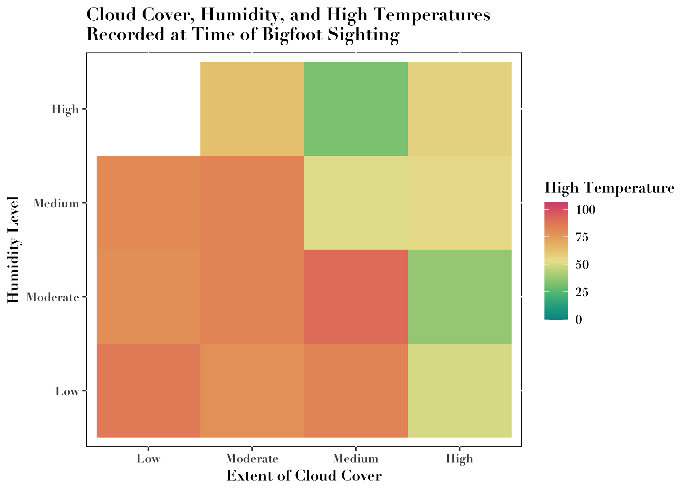
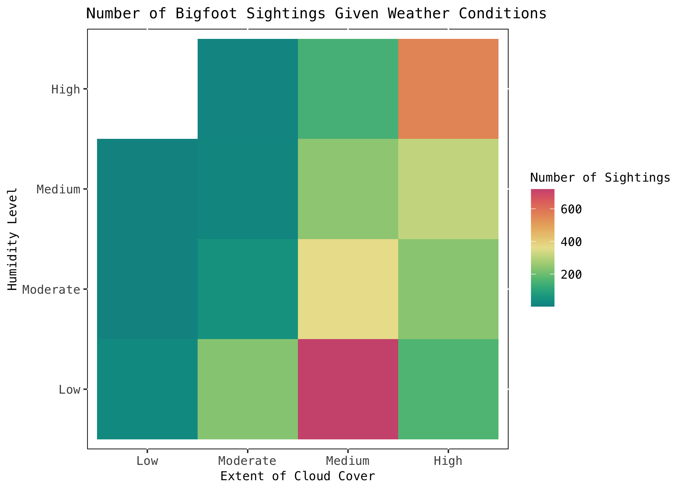
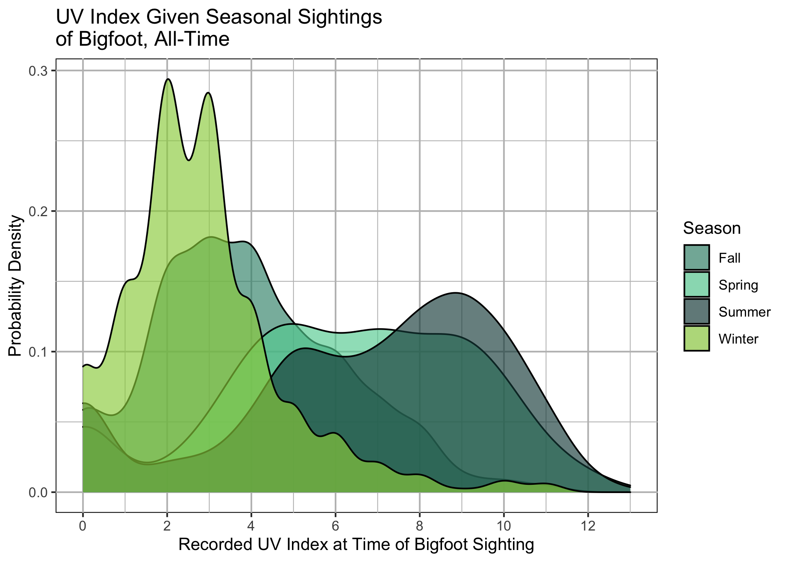
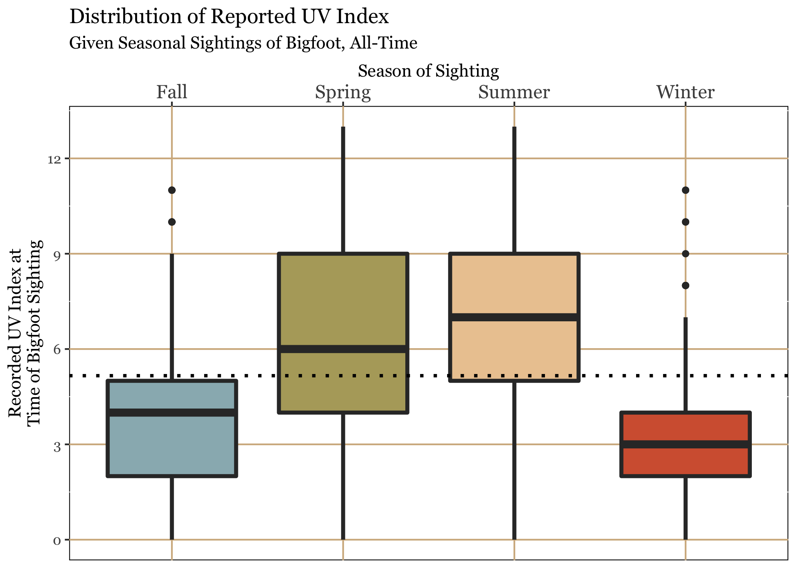

```{r, eval = T, message=F, warning=F, echo=FALSE, results= 'hide'}
# install.packages("paletteer", "scales", "lubridate", "ggrepel")
packages <- c("tidyverse", "reshape2", "fauxnaif", "gganimate", "ggthemes",
              "stringr", "gridExtra", "gifski", "png", "ggrepel", "scales",
              "lubridate", "paletteer", "GGally", "systemfonts", "extrafont")
lapply(packages, require, character.only = TRUE)
loadfonts(device = "all")

bigfoot <- read_csv("https://raw.githubusercontent.com/rfordatascience/tidytuesday/master/data/2022/2022-09-13/bigfoot.csv")
```

# So far... 

We have established some of the following *loose* guidelines. 

# Our visualizations are based on the *kind* of data we have 

1) Continuous data (AKA quantitative data, numerical data)-- to reiterate this is data that has a "natural" numerical form or measurement. 

```{r, eval = T, message=F, warning=F, echo=T}
bigfoot$dew_point[1:45]
```


# Our visualizations are based on the *kind* of data we have 

2) Categorical data (AKA qualitative data), we might also call this discrete data in some cases, this data does not *necessarily* have a natural, direct numerical form or measurement. The exception to this is integer counts-- wherein we have a direct integer form but we can't have like half a count (e.g. number of siblings). 

```{r, eval = T, message=F, warning=F, echo=T}
bigfoot$season[1:45]
```


# We can further constrained by the way that we package that data

\begin{table}
\centering
\begin{tabular}{|l|p{0.5\textwidth}|}
\hline 
\textbf{Type of Information} & \textbf{Suggested Visualization}\\ 
\hline
Amounts & *bars*, dots, *heatmap* \\
\hline 
Distributions & *histogram*, *density plot*, qq-plot, *boxplot*, *violin plot*, strip chart\\
\hline 
Proportions & *bars*, *density plot*, mosaiac plot, treemap, parallel set \\
\hline
Relations & *scatterplot*, bubblechart, *slopegraph*, contour plot, bins, *correlogram*, *line graph* \\
\hline
\end{tabular}
\end{table}


# Amounts and Proportions

Bar Chart 

```{r, eval = T, message=F, warning=F, echo=FALSE}
ggplot(bigfoot, aes(x = season)) +
  geom_bar(fill = "#009E73") + 
  labs(y = "Number of Observations", x = "Season", 
       title = "Number of Bigfoot Observations by Season") + 
  scale_x_discrete(limits = c("Summer", "Fall", "Spring", "Winter", "Unknown")) + 
  ylim(0, 2000) + 
  theme(legend.position = "none", title = element_text(size = 9)) -> plot_bar

bigfoot$date<- as.Date(bigfoot$date, format = "%Y-%m-%d")
bigfoot$year <- year(bigfoot$date)

bigfoot %>%
  group_by(season) %>%
  count() %>%
  mutate(percent_season = (n/dim(bigfoot)[1])*100) -> seasonal_percentage

ggplot(seasonal_percentage, aes(y = percent_season, x = season)) +
    geom_bar(stat = "identity", fill = "#009E73")  + 
    labs(y = "Percent of Total Observations", x = "Season", 
         title = "Percentage of Bigfoot Observations\nAccounted for by Season") + 
    scale_x_discrete(limits = c("Summer", "Fall", "Spring", "Winter", "Unknown")) + 
    ylim(0,100)+
      theme(legend.position = "none", title = element_text(size = 11))-> plot_prop 

grid.arrange(plot_bar, plot_prop, ncol = 2)
```

# Amounts and Proportions 

Heatmap 

\centering

```{r, echo=FALSE, out.width="80%", out.height= "80%"}

```


```{r, eval = F, message=F, warning=F, echo=FALSE}

bigfoot %>% 
  mutate(
    # Create categories
    humidity_cat = dplyr::case_when(
      humidity <= 0.25            ~ "Low",
      humidity > 0.25 & humidity <= 0.5 ~ "Moderate",
      humidity > 0.5 & humidity <= 0.75 ~ "Medium",
      humidity > 0.75             ~ "High"
    ),
    # Convert to factor
    humidity_cat = factor(
      humidity_cat,
      level = c("Low", "Moderate", "Medium", "High")
    ), 
    cloud_cover_cat = dplyr::case_when(
      cloud_cover <= 0.25            ~ "Low",
      cloud_cover > 0.25 & cloud_cover <= 0.5 ~ "Moderate",
      cloud_cover > 0.5 & cloud_cover <= 0.75 ~ "Medium",
      cloud_cover > 0.75             ~ "High"
    ),
    # Convert to factor
    cloud_cover_cat = factor(
      cloud_cover_cat,
      level = c("Low", "Moderate", "Medium", "High")
    )
  )->bigfoot

bigfoot %>% 
  filter(!is.na(humidity_cat), !is.na(cloud_cover_cat))%>%
  ggplot(aes(x = humidity_cat, y = , cloud_cover_cat, fill = temperature_high))+
  geom_tile() + 
  scale_fill_paletteer_c("grDevices::Temps", name = "High Temperature")  +
  labs(x = "Extent of Cloud Cover", 
       y = "Humidity Level", 
       title = "Cloud Cover, Humidity, and High Temperatures\nRecorded at Time of Bigfoot Sighting") +
  theme(text = element_text(face = "bold", family = "Didot"), 
        panel.background = element_rect(fill = "white", color = "black")) -> heatmap_bigfoot1

ggsave("heatmap_bigfoot.png", heatmap_bigfoot1, width = 7, height = 5)
```


# Amounts and Proportions 

Heatmap 2

\centering

```{r, echo=FALSE, out.width="80%", out.height= "80%"}

```


```{r, eval = F, message=F, warning=F, echo=FALSE}

bigfoot %>%
  group_by(humidity_cat, cloud_cover_cat) %>%
  count() -> atmospheric_count

atmospheric_count %>% 
  filter(!is.na(humidity_cat), !is.na(cloud_cover_cat))%>%
  ggplot(aes(x = humidity_cat, y = , cloud_cover_cat, fill = n))+
  geom_tile() + 
  scale_fill_paletteer_c("grDevices::Temps", name = "Number of Sightings")  +
  labs(x = "Extent of Cloud Cover", 
       y = "Humidity Level", 
       title = "Number of Bigfoot Sightings Given Weather Conditions") +
  theme(text = element_text(family = "Menlo"), 
        panel.background = element_rect(fill = "white", color = "black"), 
        title = element_text(size = 9)) -> heatmap_bigfoot2

ggsave("heatmap_bigfoot2.png", heatmap_bigfoot2, width = 7, height = 5)
```


# Distributions 

Densities and boxplots

\centering

```{r, echo=FALSE, out.width="80%", out.height= "80%"}

```


```{r, eval = F, message=F, warning=F, echo=FALSE}
bigfoot %>%
  filter(season!= "Unknown") %>%
  ggplot(aes(x = uv_index, fill = season))+ 
  geom_density(alpha = 0.65) +
  scale_fill_paletteer_d("palettetown::bulbasaur", name = "Season") +
  scale_x_continuous(breaks = seq(min(bigfoot$uv_index, na.rm = T),
                                  max(bigfoot$uv_index, na.rm = T)+1, 2))+
  theme(panel.background = element_rect(color = "black", fill = "white"), 
        panel.grid = element_line(color = "grey")) + 
  labs(x = "Recorded UV Index at Time of Bigfoot Sighting", 
       y = "Probability Density",
       title = "UV Index Given Seasonal Sightings\nof Bigfoot, All-Time")-> uv_index_plot

ggsave("uv_index_plot.png", uv_index_plot, width = 7, height = 5)
```


# Distributions 

Densities and boxplots

\centering

```{r, echo=FALSE, out.width="80%", out.height= "80%"}

```

```{r, eval = F, message=F, warning=F, echo=FALSE}
bigfoot %>%
  filter(season!= "Unknown") %>%
  ggplot(aes(y = uv_index, x = season, fill = season))+ 
  geom_boxplot(alpha = 1, lwd = 1.2) +
  geom_hline(yintercept = mean(bigfoot$uv_index, na.rm= T), 
             color = "black", 
             lty = "dotted", lwd = 1)+ 
  scale_fill_paletteer_d("lisa::FernandoBotero", name = "Season") +
  scale_y_continuous(breaks = seq(0, 13, 3) )+
  labs(y = "Recorded UV Index at\nTime of Bigfoot Sighting", 
       x = "Season of Sighting",
       title = "Distribution of Reported UV Index",
       subtitle = "Given Seasonal Sightings of Bigfoot, All-Time") + 
  scale_x_discrete(position = "top") + 
  theme(axis.text.x = element_text(size = 12), 
        panel.background = element_rect(fill = "white", color = "black"), 
        panel.grid.major = element_line(color= "tan"), 
         text = element_text(family = "Georgia"), 
        legend.position = "none")->uv_index_box

ggsave("uv_index_box.png", uv_index_box, , width = 7, height = 5)
```

# Distributions 

Violin Plot 

\centering

```{r, eval = T, message=F, warning=F, echo=FALSE}

bigfoot %>%
  filter(season!= "Unknown", !is.na(dew_point), dew_point > 0) %>%
  ggplot(aes(x = dew_point, y = season, fill = season))+ 
  geom_violin() +
  geom_vline(xintercept = mean(bigfoot$dew_point, na.rm = T), 
             color = "black", lwd = 1, lty = "dotted") + 
  scale_fill_paletteer_d("rockthemes::alice", name = "Season") +
  theme(panel.background = element_rect(color = "white")) + 
  labs(x = "Recorded Dew Point on Date of Bigfoot Sighting", 
       y = "Season",
       title = "Dew Point Given Seasonal Sightings of Bigfoot, All-Time") + 
  theme(panel.background = element_rect(fill = "tan", color = "black"), 
        panel.grid.major.y = element_blank(), 
        text = element_text(family = "Palatino")) 
```

# Relations

Scatter and jitterplots


```{r, eval = T, message=F, warning=F, echo=FALSE}
bigfoot %>%
  filter(season!= "Unknown", dew_point > 0) %>%
  ggplot(aes(x = dew_point, y = pressure, color = season)) +
  geom_point(alpha = 0.65) + 
  labs(y = "Atmospheric Pressure", x = "Dewpoint", 
       title = "Atmospheric Presure Given Dewpoint", 
       subtitle = "Among Reported Bigfoot Sightings")+
  scale_color_paletteer_d("nationalparkcolors::Hawaii", 
                          name = "Season") -> plot_point


bigfoot %>%
  filter(season!= "Unknown", dew_point > 0) %>%
  ggplot(aes(x = dew_point, y = pressure, color = season)) +
  geom_point(alpha = 0.55) + 
  geom_smooth(color = "black") + 
  labs(y = "Atmospheric Pressure", x = "Dewpoint", 
       title = "Atmospheric Presure Given Dewpoint")+
  facet_wrap(~season)+ 
  theme(legend.position = "none")+
  scale_color_paletteer_d("nationalparkcolors::Hawaii", 
                          name = "Season") -> plot_point_2 


grid.arrange(plot_point, plot_point_2, ncol = 2)
```


# Relations 

Slopegraph 
```{r, eval = T, message=F, warning=F, echo=FALSE}

#bigfoot %>%
  #group_by(state) %>%
  #count() %>%
  #arrange(desc(n))

bigfoot %>%
  filter(state == "Washington" |state == "California") %>%
  group_by(state) %>%
  summarize(avg_high = mean(temperature_high, na.rm = T), 
            avg_low = mean(temperature_low, na.rm = T)) %>% 
  #high temp
  ggplot(aes(x = state, y = avg_high, group = state, color = state)) +
  geom_line(aes(x = state, group = 1), color = "black") +
  #low temp 
  geom_line(aes(y = avg_low, group = 1), color = "black") +
  geom_point(aes(y = avg_low, x = state), size = 4) +
  geom_point(aes(color = state), size = 4) + 
  labs(y = "Average Temperature at Time of Sighting", x = "State", 
       title = "Comparison of Average High and Low Temperatures (F)\nAmong States with Highest All-Time Bigfoot Sightings") +
  scale_color_manual(values = c("#8092B0FF", "#BBA24CFF"), 
                          name = "State") +
  scale_x_discrete(position = "top")+
  ylim(0, 100)+ 
  annotate("label", x = "Washington", y = 68, 
           label ="Average High Temp.", 
           hjust = 0.2, color = "black", size = 4) +
  annotate("label", x = "Washington", y = 35, 
           label ="Average Low Temp.", 
           hjust = 0.2, color = "black", size = 4)+
  theme(
  panel.grid.minor.y = element_blank(),
  panel.grid.minor.x = element_blank())
  

# paletteer_d(`"peRReo::rosalia"`)

```

# Relations 

Correlogram 

```{r, eval = T, message=F, warning=F, echo=FALSE}
ggpairs(bigfoot, columns = c(15:21)) 

```


# And from that point we can choose to include more information. 

Potential additions, usually on the basis of categorical variables OR for clarity's sake: 

- Position:

  - Jitter
  
  - Grouping 
  
  - Faceting/Multiples 
  
  - Compound 

- Color (either outline color or fill)

  - Discrete color 
  
  - Gradient color 

- Shape 

- Transparency (either to make it easier to see density of data *or* as a function of another variable)


# And we'll get to more later to account for...

- Uncertainty and statistics

- Atypical coordinate systems 

# Beyond that...

We have a couple of style guidelines we have established: 

- Principle of proportional ink-- **the size of the ink representing data points need to be *proportional* to the data values they represent**.
  
  - Scales, data coverage, etc. 
  
- Color and shapes for: 

  - Distinguishing groups (categorical)

  - Represent data values (continuous)

  - Highlighting information 
  
# Hazards 

- Color and shape have limits. So, **RULE OF THUMB**: Qualitative color scales best for 3-5 categories, maybe less if we have some other transformations. 

- Choose interpretation over ultimate aesthetic vibes. 

- Provide ALT text when appropriate (i.e. a text caption in addition to your )


# Getting fancy? 

- Now we have also added some more swanky elements, like high level customization with `theme()` settings. 

- Also, `gganimate()`. 


# Anything else? 

# Now what does all of this assume so far? 

- A lot of what we have done so far kind of assumes that we have data that is already packaged as we want or need it. Or, I have just brushed over the code so that we can get where we want to go. 

- We have worked through some ways to transform your data from one type to another (i.e. `melt()` or `pivot.wider()`), but this doesn't necessarily transform individual variables into summary points that we can plot. 

- Nor do we have guidance on *what* sorts of summaries are decent, other than raw counts or proportions. 