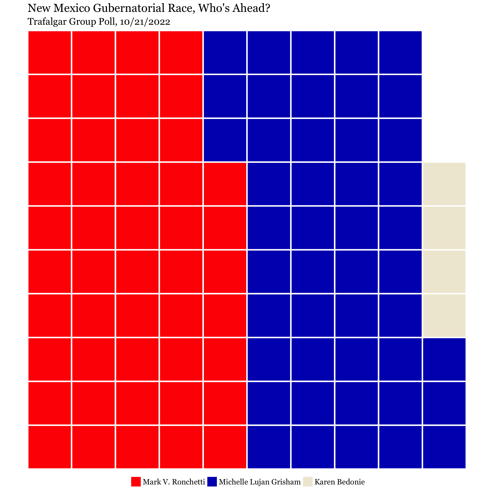
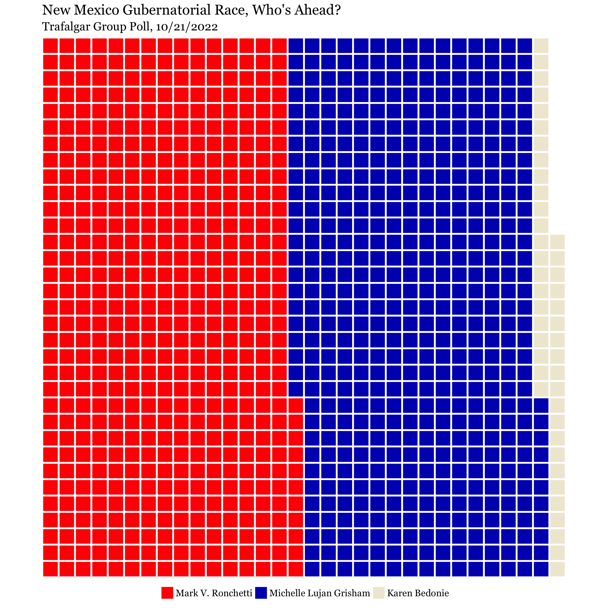
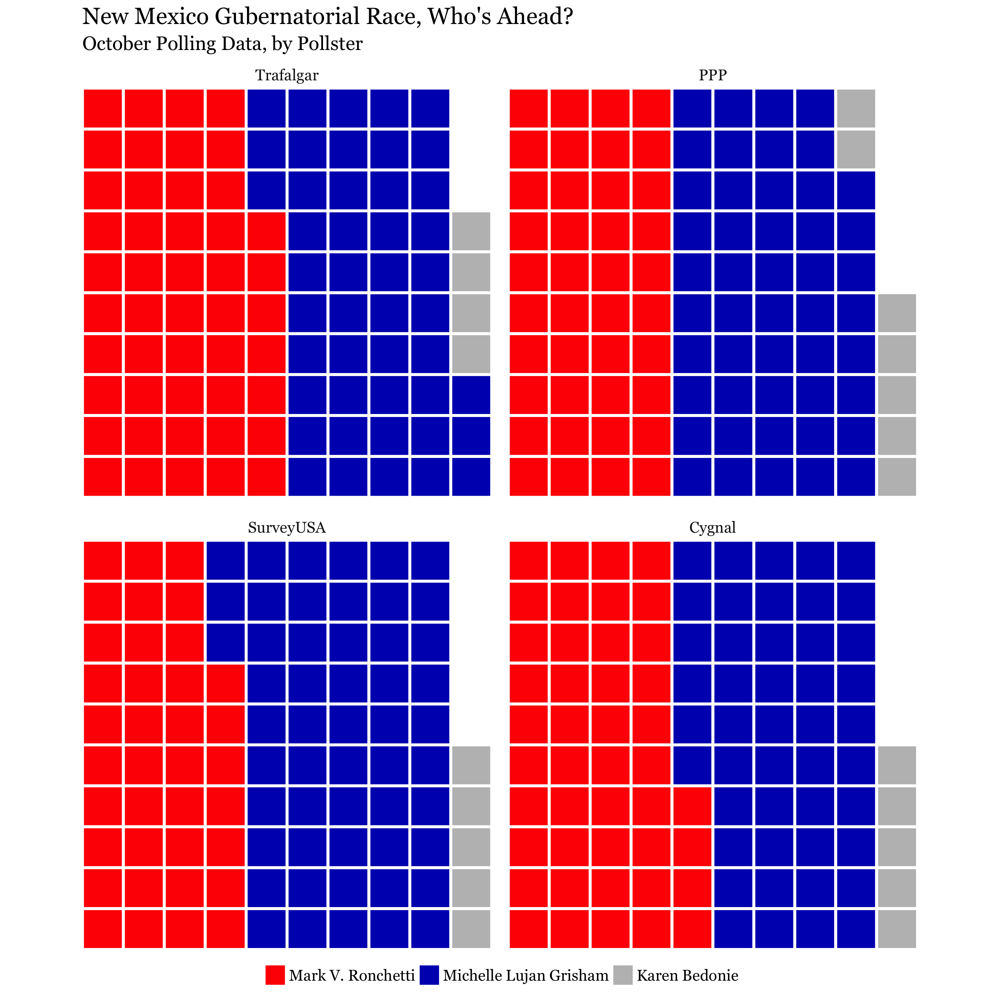
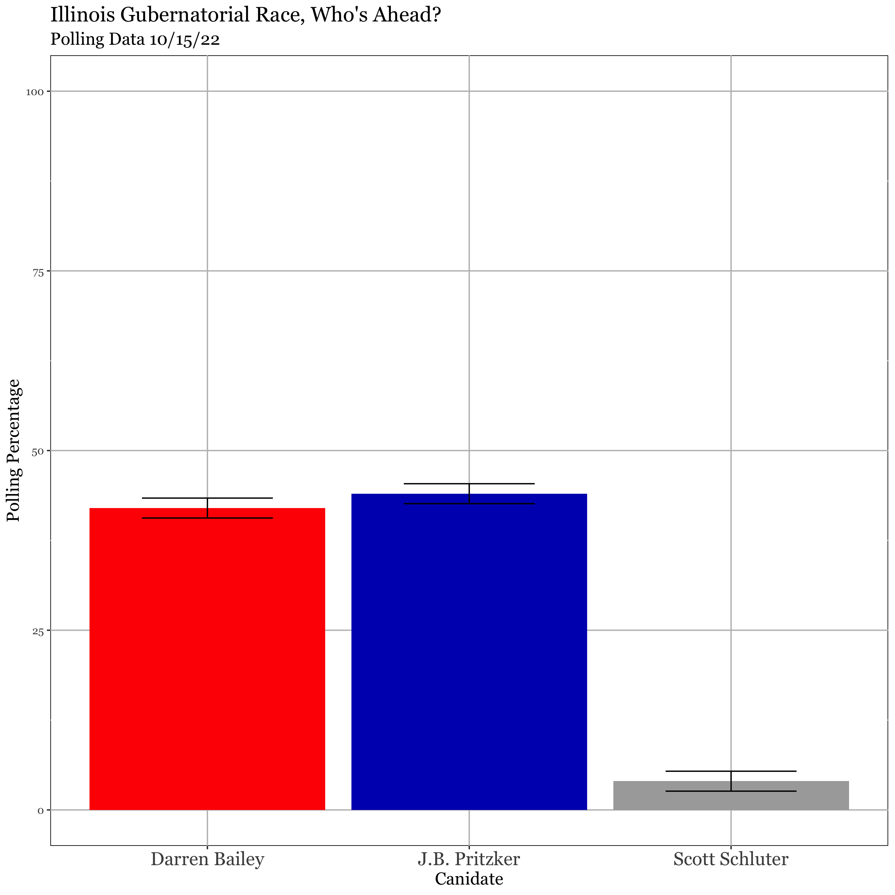

```{r datasetup, include = F, eval =T, results = "hide", warning=F}
packages <- c("tidyverse", "reshape2", "fauxnaif", "gganimate", "ggthemes",
              "stringr", "gridExtra", "gifski", "png", "ggrepel", "scales",
              "lubridate", "paletteer", "GGally", "systemfonts", "extrafont", "colorspace")
lapply(packages, require, character.only = TRUE)
loadfonts(device = "all")

nm_gov_poll <- read_csv("~/Library/CloudStorage/OneDrive-NorthwesternUniversity/Teaching_RA/2022_Fall_DataViz/lousy-graphs/data/nm_gov_poll2022_538.csv")
```

# Why do we need to account for uncertainty? 

- The idea of a *statistic* or some estimate is not only to say something about that quantity for the sample of data, but also about the population of interest. 

- We can think of the relationship of a sample and a population like an overlapping circle. 

\centering 
\begin{tikzpicture}[][thick]
   \draw (0,0) circle (1.8cm);
   \draw (-0.75,0.45) circle (0.75cm);
   \draw (-.75,0.45) node {sample};
   \draw (0.3,-1) node {population};
\end{tikzpicture}

# Population Inference 

\centering 
\begin{tikzpicture}[][thick]
   \draw (0,0) circle (1.8cm);
   \draw (-0.75,0.45) circle (0.75cm);
   \draw (-.75,0.45) node {sample};
   \draw (0.3,-1) node {population};
\end{tikzpicture}

- Sampling: Allows us to capture some "things" in the sample to make inferences about the greater body of "things" in the population. 

- Our inferences thus come with some uncertainty. Our knowledge about a *snippet* of the population cannot tell us, with 100 percent certainty, the exact fact of the population. 

- Consequentially, much of statistics, and thus *reporting statistics*, relies on understanding how to account for uncertainty. 

- Our degree of uncertainty reflects the validity and potential precision of the measurement of interest. 

# An easy example 

- Polling Data

# What is *uncertainty*? 


# --- 

- In each of the visualizations that we have made so far, there is some element of uncertainty around the quantity that we have visualized. 

- But, uncertainty does indeed exist across all data. Most reliably due to this issue of population inference-- which is uncertainty we can account for. Otherwise we have measurement error, sampling biases, non-response, variation in sample sizes, etc. 

- If we can account for *one* of these sources of uncertainty, then we should do so! 

# Okay, but what does it matter? 

\url{https://twitter.com/Brad_Setser/status/1584362527743672320}

# Ways that we see this 

- Margin of error, confidence intervals, or standard errors are the most likely to be published in text. We can easily translate these from one to another 

- Visually we are likely to encounter error bars, highlighted confidence intervals, or some other sort of visual differentiation between a given estimate and the surrounding potential range of values. 

# What to expect here 

- All that to say, I don't us expect to learn everything in a day or even a quarter of how to think of and understand statistical uncertainty. 

- Instead, some methods of visualization and certain components of ggplot2 make adding on uncertainty an easy thing to do. 

- Today's lesson is taken from [Wilke Ch. 16](https://clauswilke.com/dataviz/visualizing-uncertainty.html). Some of my code from today is thus adapted from a lot of the ideas worked out in there, but with a different application. 

# Confidence Intervals 

- We will encounter confidence intervals here (CIs for short). I'd like for us to know how to interpret this correctly, especially related to our confidence levels. 

- Confidence intervals specify a potential range of values for a potential measurement of interest, given an associated confidence level. 

$$CI = \text{Measurement} \pm MoE  = [\text{Upper Bound, Lower Bound}]$$ 


- Where the **Margin of Error (MoE)** is the standard error ($\sigma\over\sqrt{n}$) multiplied by the Z-or t-score relative to the chosen confidence level (typically 95\%, but also 90\% and 99\% possible). 

# Interpreting a Confidence Interval 

- The associated confidence level that we use to calculate the margin of error **does not** mean: "I am 95\% sure that the true measurement lies within this CI." 

- Rather the confidence interval states something like: "If this measurement were collected iteratively among different samples, around 95\% of those collected samples would also contain the true value upon calculating a 95\% confidence interval." 

- TBH the [Wikipedia on Confidence Intervals](https://en.wikipedia.org/wiki/Confidence_interval) is pretty good in reframing the interpretation in different ways.  

# Data Source 

Today's data comes from FiveThirtyEight, specifically their current gubernatorial polling data. I have limited the subset to *only* reflect New Mexico data for simplicity.  

\url{https://projects.fivethirtyeight.com/polls/governor/2022/new-mexico/}

# Probabilities and frequencies 

- Probability, and thus uncertainty, can be made a bit more concrete when we nest a particular outcome as a frequency or proportion. 

- We have already done this some with bar charts or histograms. But, we can visualize this as an array. 

- If we visualize an anticipated outcome and its probability relative to the other possible outcomes, this is called a **discrete outcome visualization**. 

- To visualize probability as a likely frequency (e.g. 1 out of 100, 3 out of 40, etc.) is called frequency framing. 

# An example from current polling data:

\centering 

```{r trafalgar_pct_knit, echo=FALSE, out.width="65%", out.height= "80%"}

```

```{r trafalgar_pct, include = F, eval = F, warning=F}
dummy_frame<- expand.grid(x = 1:10, y = 1:10)

value <- c(rep("Mark V. Ronchetti", 47), 
           rep("Michelle Lujan Grisham", 46), 
           rep("Karen Bedonie", 4),
           rep(NA, 3))

dummy_frame <-data.frame(dummy_frame, value)

dummy_frame %>%
  filter(!is.na(value))%>%
ggplot(aes(x= y, y=x, fill = value)) +
  geom_tile(color = "white", size = 1) +
  coord_fixed(expand = FALSE, clip = "off") +
  scale_x_continuous(name = NULL, breaks = NULL) +
  scale_y_continuous(name = NULL, breaks = NULL) +
  scale_fill_manual(
    breaks = c("Mark V. Ronchetti", 
               "Michelle Lujan Grisham", 
               "Karen Bedonie", 
               "Other"), 
    name = NULL,
    labels = c("Mark V. Ronchetti", 
               "Michelle Lujan Grisham", 
               "Karen Bedonie", 
               "Other"),
    values = c("#FF0000", "#0015BC", "#F0EAD6", "#000000"),
    guide = guide_legend(override.aes = list(size = 0))
  ) +
  labs(title = "New Mexico Gubernatorial Race, Who's Ahead?", 
       subtitle = "Trafalgar Group Poll, 10/21/2022")+ 
  theme(
    title = element_text(size = 14), 
    text = element_text(family = "Georgia", size = 14), 
    panel.spacing = unit(12, "pt"),
    legend.position = "bottom",
    legend.direction = "horizontal",
    legend.justification = "center",
    legend.box.spacing = unit(6, "pt"), 
    legend.spacing.x = unit(3, "pt"),
    legend.key.size = unit(14, "pt"), 
    panel.background = element_blank()
  )-> trafalgar_pct
ggsave("trafalgar_pct.png", trafalgar_pct, width = 10, height= 10)

```
# Alternatively: 

\centering 

```{r full_trafalgar_knit, echo=FALSE, out.width="65%", out.height= "80%"}

```


```{r full_trafalgar, include = F, eval = F, warning=F}
dummy_frame2<- expand.grid(x = 1:33, y = 1:33)

value2 <- c(rep("Mark V. Ronchetti", 506), 
           rep("Michelle Lujan Grisham", 495), 
           rep("Karen Bedonie", 43),
           rep(NA, 45))

dummy_frame2 <-data.frame(dummy_frame2, value2)

dummy_frame2 %>%
  filter(!is.na(value2))%>%
  ggplot(aes(x= y, y= x, fill = value2)) +
  geom_tile(color = "white", size = 1) +
  coord_fixed(expand = FALSE, clip = "off") +
  scale_x_continuous(name = NULL, breaks = NULL) +
  scale_y_continuous(name = NULL, breaks = NULL) +
  scale_fill_manual(
    breaks = c("Mark V. Ronchetti", 
               "Michelle Lujan Grisham", 
               "Karen Bedonie"), 
    name = NULL,
    labels = c("Mark V. Ronchetti", 
               "Michelle Lujan Grisham", 
               "Karen Bedonie"),
    values = c("#FF0000", "#0015BC", "#F0EAD6"),
    guide = guide_legend(override.aes = list(size = 0))
  ) +
  labs(title = "New Mexico Gubernatorial Race, Who's Ahead?", 
       subtitle = "Trafalgar Group Poll, 10/21/2022")+ 
  theme(
    panel.background = element_blank(),
        title = element_text(size = 14),
    text = element_text(family = "Georgia", size = 14), 
    panel.spacing = unit(12, "pt"),
    legend.position = "bottom",
    legend.direction = "horizontal",
    legend.justification = "center",
    legend.box.spacing = unit(6, "pt"), 
    legend.spacing.x = unit(3, "pt"),
    legend.key.size = unit(14, "pt")
  )-> trafalgar_full

ggsave("trafalgar_full.png", trafalgar_full, width = 10, height =10)
```
# And a different iteration, by pollster: 

\centering 

```{r all_polls_knit, echo=FALSE, out.width="65%", out.height= "80%"}

```


```{r melted_plot, include = F, eval = F, warning=F}
dummy_frame3<- expand.grid(x = 1:10, y = 1:10)

Trafalgar <- c(rep("Mark V. Ronchetti", 47), 
           rep("Michelle Lujan Grisham", 46), 
           rep("Karen Bedonie", 4),
           rep(NA, 3))

PPP <- c(rep("Mark V. Ronchetti", 40), 
           rep("Michelle Lujan Grisham", 48), 
           rep("Karen Bedonie", 7),
           rep(NA, 5))

SurveyUSA <- c(rep("Mark V. Ronchetti", 37), 
           rep("Michelle Lujan Grisham", 53), 
           rep("Karen Bedonie", 5),
           rep(NA, 5))

Cygnal <- c(rep("Mark V. Ronchetti", 44), 
           rep("Michelle Lujan Grisham", 46), 
           rep("Karen Bedonie", 5),
           rep(NA, 5))

dummy_frame3 <-data.frame(dummy_frame3, Trafalgar, PPP, SurveyUSA, Cygnal)

melted_dummy_frame <- melt(dummy_frame3, id.vars = c("x", "y"))

melted_dummy_frame %>%
  filter(!is.na(value)) %>%
  ggplot(aes(x= y, y= x, fill = value)) +
  geom_tile(color = "white", size = 1) +
  coord_fixed(expand = FALSE, clip = "off") +
  scale_x_continuous(name = NULL, breaks = NULL) +
  scale_y_continuous(name = NULL, breaks = NULL) +
  facet_wrap(~variable) + 
  scale_fill_manual(
    breaks = c("Mark V. Ronchetti", 
               "Michelle Lujan Grisham", 
               "Karen Bedonie"), 
    name = NULL,
    labels = c("Mark V. Ronchetti", 
               "Michelle Lujan Grisham", 
               "Karen Bedonie"),
    values = c("#FF0000", "#0015BC", "grey"),
    guide = guide_legend(override.aes = list(size = 0))
  ) +
  labs(title = "New Mexico Gubernatorial Race, Who's Ahead?", 
       subtitle = "October Polling Data, by Pollster")+ 
  theme(
        title = element_text(size = 14), 
    text = element_text(family = "Georgia", size = 14), 
    panel.spacing = unit(12, "pt"),
    panel.background = element_blank(),
    strip.background = element_blank(),
    legend.position = "bottom",
    legend.direction = "horizontal",
    legend.justification = "center",
    legend.box.spacing = unit(6, "pt"), 
    legend.spacing.x = unit(3, "pt"),
    legend.key.size = unit(14, "pt")
  )->all_nm_polls

ggsave("all_nm_polls.png", all_nm_polls, width = 10, height = 10)
```

# Representing uncertainty via discrete outcomes

- This usually works pretty good as long as we are scaling appropriately. Can trade precision for interpretability's sake, but NOT MUCH! 

- People do better at perceiving these types of visualizations so long as the number is not *too* great. 

- Possible to combine discrete outcome plots with a continuous distribution, but limited utility for our data potentially? (Quantile dotplot for those of you that are interested.) Can also be easily taken as plotting a continuum, rather than discrete event possibilities, therefore limiting their ease of interpretation. 


```{r gov_poll_data, eval = F, include = F, warning=FALSE}
gov_poll <- read_csv("~/Library/CloudStorage/OneDrive-NorthwesternUniversity/Teaching_RA/2022_Fall_DataViz/lousy-graphs/data/2022_all_governor_polls.csv")

gov_poll %>% 
  filter(state == "Illinois") %>%
  select(poll_id, candidate_name, party, pct, sample_size, end_date)-> il_gov_poll


il_gov_poll %>%
  filter(end_date == "10/15/22") %>% 
  group_by(candidate_name) %>%
  summarise(mean_pct = pct, 
            se_pct = sd(il_gov_poll$pct, na.rm = T)/sqrt(sample_size)) %>%
  mutate(lower_bound = mean_pct - (se_pct*1.96), 
         upper_bound = mean_pct + (se_pct*1.96))-> recent_il_gov_poll

recent_il_gov_poll %>%
  ggplot(aes(candidate_name, mean_pct, fill = candidate_name)) +
  geom_bar(stat = "identity") + 
  geom_errorbar(aes(ymin = lower_bound, ymax = upper_bound), width = 0.5) + 
  ylim(0, 100) + 
  scale_fill_manual(values = c("#FF0000", "#0015BC", "darkgrey")) + 
    theme(
    axis.text.x = element_text(size = 15), 
    panel.background = element_rect(fill = "white",
                                    
                                    color = "black"),
    panel.grid.major = element_line(color = "grey"), 
        title = element_text(size = 14), 
    text = element_text(family = "Georgia"), 
    panel.spacing = unit(12, "pt"),
    legend.position = "none"
  ) + 
  labs(x = "Canidate", y = "Polling Percentage", 
       title = "Illinois Gubernatorial Race, Who's Ahead?", 
       subtitle = "Polling Data 10/15/22") -> illinois_recent_gg

ggsave("illinois_recent_poll.png", illinois_recent_gg, width = 10, height = 10)
```

# Point Estimates

- We will get to this on Thursday, as it requires more calculation and R manipulation. 
- We will revisit these w.r.t Illinois polling data instead. 

- But the concept instead is to provide the exact measurement available with the data, then show the range of potential values 

- Could be mean, median, or the entire distribution that we can place a potential interval around. 

# Example with Illinois Polling Data 

\centering 

```{r illinois_knit, echo=FALSE, out.width="65%"}

```

# Key Change: Data Management 

What are best data management practices YOU ALL know of? 

I can wait...

# Data versions, saving data, sharing data, etc.

Let's rank order these data file names from BEST to WORST: 

1. `2018 Survey from Afrobarometer.csv(download)`

2. `2021_july21_media_survey_PANEL.csv`

3. `22-08-31_ColombiaStateCapacity_Project2020v2.dta`

4. `ANES_2018_v3.dta`

5. `2022-subset: anes.csv`

# Saving and re-saving data

1. **Date**  

2. **Clear, concise names that identify the project and data type**

3. **Skip the strange characters and spaces in file names:** 

4. **Version control** 

# What about code? 

- *Annotated code is the best code!*

- Everything else is not great :) 

- If I got locked out of this file for a year, what kind of signs would I want to have left myself so I can continue on without problem? 

- Metaphor of parking on a downhill slope. I recommend the same for writing.  

# Sending code or troubleshooting 

- Reprex 

- File paths 

- Error messages 


# Structuring projects 

- Let me reiterate: R Projects

- Adding more files seems cumbersome, but if we can manage chaos by grouping together like things, then we make our project's lifelines visible to US and everyone else. 

- If a stranger was to visit your project page, github repo, etc. would they have to spend more than 2 minutes looking through it to understand the structure? 

# Visualization Blog 2, next week :( 

- Will post by end of the day on Canvas. 

- Slight modification to original assignment-- I know y'all are tired (so am I). 

- So, we'll do something a bit less intense. 

# Visualization Blog 2 Prompt: 

Two options: 

1) Make two original visualizations and figure out how to account for uncertainty in them. Tell me how you calculated the uncertainty and why you visualized uncertainty in this way. One of these visualizations can come from one of your previous assignments. 

2) Find two visualizations you really don't like and then turn them into something better. Particularly, this improvement should reflect design principles you like and that reflects this "brand" you have been trying to build. 


[Here is a freebie.](https://twitter.com/AlecStapp/status/1582704817612283904)


