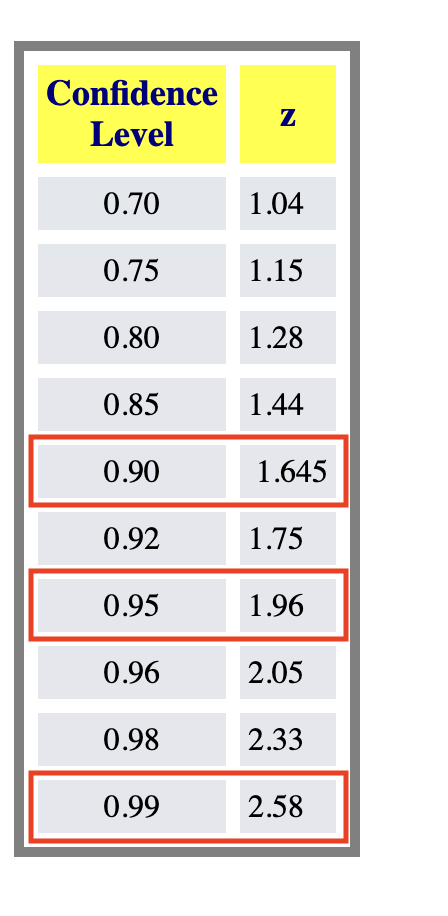
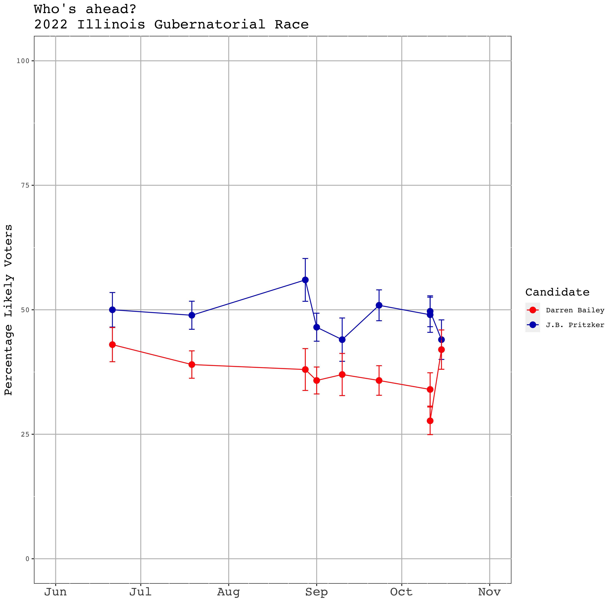
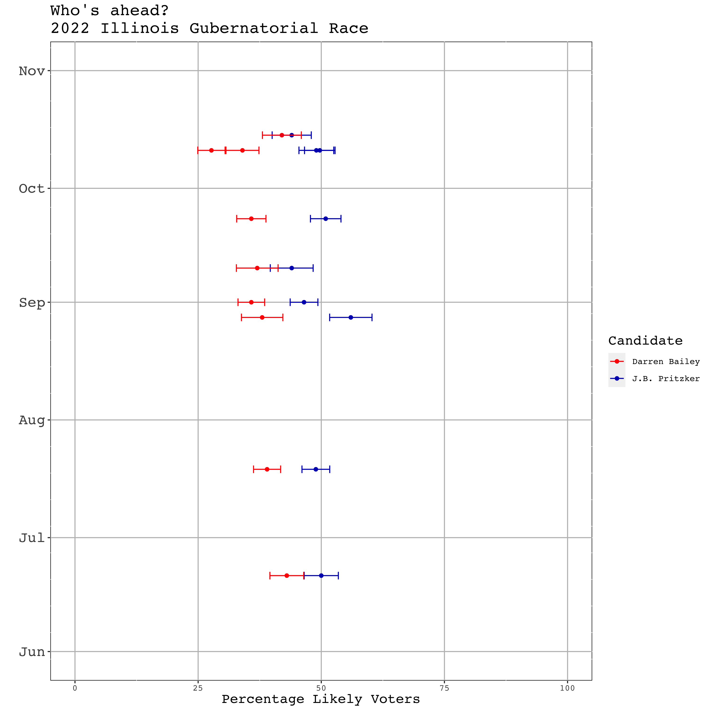
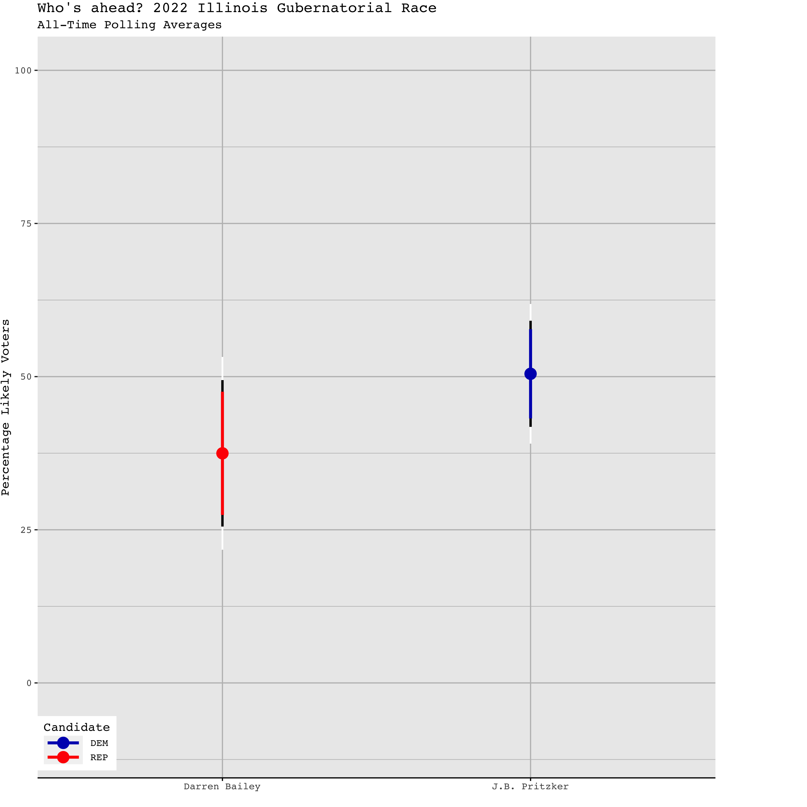
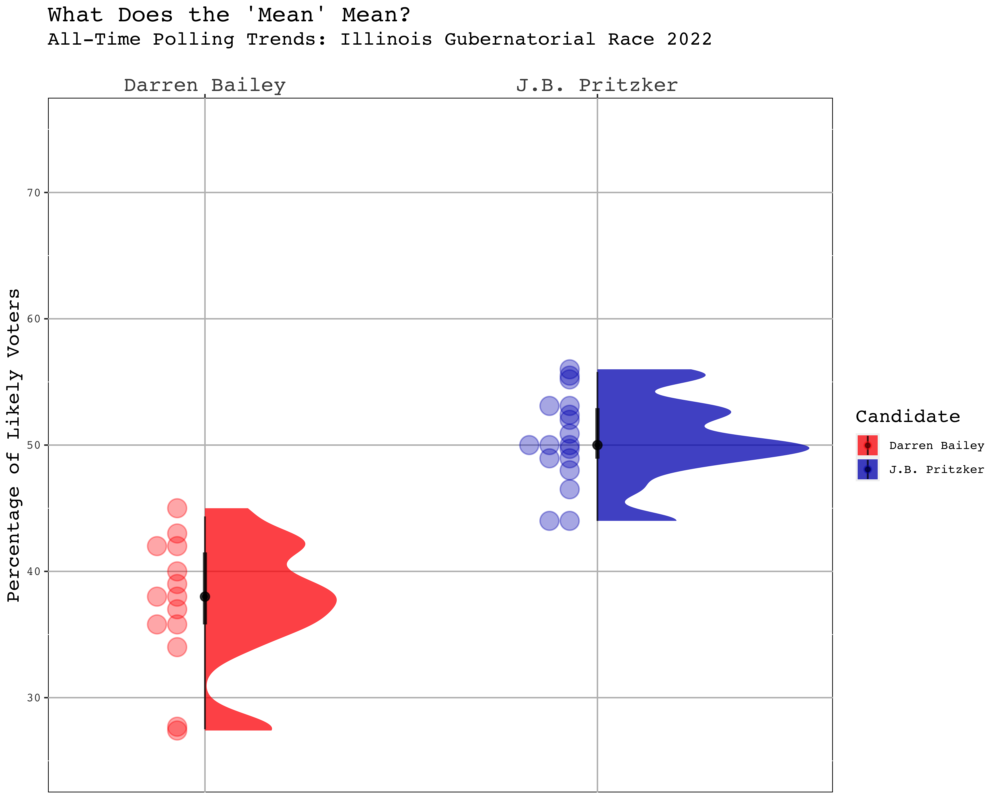
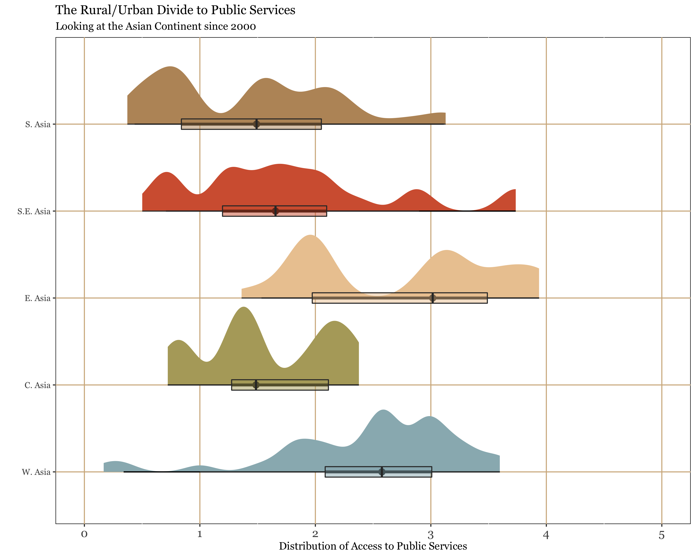
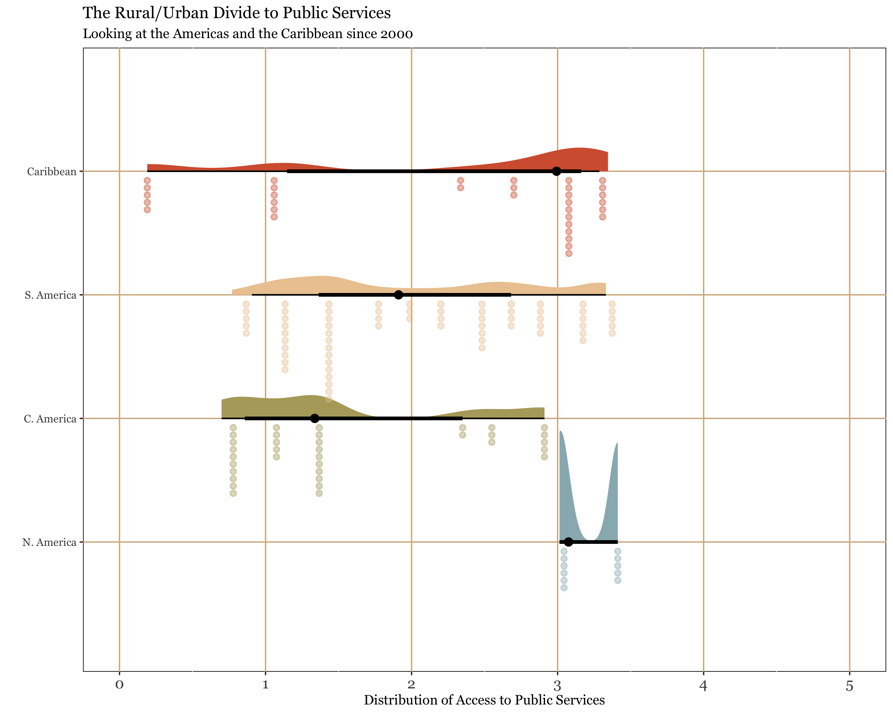

# Continuing on with Uncertainty 

>- First, let's recap why we deal with uncertainty. 

Potential measures and ways to visualize uncertainty: 

>- Margin of error, confidence intervals, or standard errors are the most likely to be published in text. We can easily translate these from one to another 

>- Visually we are likely to encounter error bars, highlighted confidence intervals, or some other sort of visual differentiation between a given estimate and the surrounding potential range of values. 

# Confidence Intervals 

- We will encounter confidence intervals here (CIs for short). I'd like for us to know how to interpret this correctly, especially related to our confidence levels. 

- Confidence intervals specify a potential range of values for a potential measurement of interest, given an associated confidence level. 

$$CI = \text{Measurement} \pm MoE  = [\text{Upper Bound, Lower Bound}]$$ 


- Where the **Margin of Error (MoE)** is the standard error ($s\over\sqrt{n}$) multiplied by the Z-or t-score relative to the chosen confidence level (typically 95\%, but also 90\% and 99\% possible). 


# Quick note of difference: standard deviation and standard error 

>- Does anyone know right off the bat what the difference is? 

>- *Standard deviation* is an estimated statistical parameter about the spread of our data. Basically the expected amount of variation from observation to observation in the sample, and consequentially inferred about the population. 

>- *Standard error* is a measure of precision relative to the sample and its associated standard deviation. 

# Formulae 

Sample Standard Deviation of Mean $s$: 

$$s = \sqrt{\frac{\Sigma^N_{i=1}(x_i-\bar x)^2}{n-1}}$$
where the numerator is the squared sum of differences between each observation $x_i$ of the variable of interest and the variable's mean ($\bar x$). The denominator is the number of observations $n$ minus 1. Easily done in R by `sd(var, na.rm = T)`.

Sample Standard Deviation of Proportion $s$: 

$$s = \sqrt{\hat \pi(1-\hat \pi)}$$

Where $\hat \pi$ is the sample proportion. 

# Formulae 

Standard Error ($SE$): 

If based on a mean: 

$$ SE = \frac{s}{\sqrt{n}} $$ 

Where $s$ is the sample standard deviation. 

If based on proportion: 


$$SE = \frac{s}{\sqrt{n}} = \sqrt{\hat \pi (1-\hat \pi) \over n}$$

# Margin of Error $\frac{s}{\sqrt{n}} \times z$

$MOE = \frac{s}{\sqrt{n}} \times z$

Where z is one of the following values: 

\centering 

```{r confidence_table, echo=FALSE, out.width="35%", out.height="80%"}


```

# Confidence levels 

- Typically we choose 95\% as our baseline. However if we visualize confidence intervals, can easily account for 90\% and 99\% visually also. 

- The higher the confidence level, the more wider the CI and thus less precise. 

# Point Estimates and Uncertainty

\centering 

```{r illinois_poll, echo=FALSE, out.width="80%", out.height="80%"}



```

# Point Estimates and Uncertainty

\centering 

```{r illinois_poll_2, echo=FALSE, out.width="80%", out.height="80%"}



```

```{r gov_poll_data, eval = F, include = F, warning=FALSE}
# typical load in of packages 
packages <- c("tidyverse", "reshape2", "fauxnaif", "gganimate", "ggthemes",
              "stringr", "gridExtra", "gifski", "png", "ggrepel", "scales",
              "lubridate", "paletteer", "GGally", "systemfonts", "extrafont", "colorspace")
lapply(packages, require, character.only = TRUE)
loadfonts(device = "all")

# read in data 
gov_poll <- read_csv("~/Library/CloudStorage/OneDrive-NorthwesternUniversity/Teaching_RA/2022_Fall_DataViz/lousy-graphs/data/2022_all_governor_polls.csv")

# subset the data 
gov_poll %>% 
  filter(state == "Illinois") %>%
  select(poll_id, candidate_name, party, pct, sample_size, end_date)-> il_gov_poll

# change this to be in proportion format so it's easier for me to see standard error weirdness 
il_gov_poll$pct <- il_gov_poll$pct/100

# now I am going to CREATE MY OWN FUNCTION 

# first name the function, then I specify the arguments used in the function by function(x, y)
std.error.prop <- function(x, n){
  # then I specify the operation I want R to perform which each of the constitutive parts of the argument 
sqrt((x * (1-x))/n)
  # here: sqrt of [x*(1-x)]/n where n is going to be a vector of sample sizes 
}

std.error.prop(x = il_gov_poll$pct, n = il_gov_poll$sample_size)

# let's try that again with the upper and lower bounds calculation 

CIbound <- function(x, y, level, upper = c("TRUE", "FALSE")){
  if (upper=="FALSE") return((x)-(y*level))
  if (upper=="TRUE") return((x)+(y*level))
}


il_gov_poll %>%
  mutate(mean_pct = pct, 
         se_pct = std.error.prop(pct, sample_size), 
         # 95 % CI 
         lower_bound_95 = CIbound(mean_pct, se_pct, 1.96, upper = F), 
         upper_bound_95 = CIbound(mean_pct, se_pct, 1.96, upper = T), 
         # 90 % CI 
         lower_bound_90 = CIbound(mean_pct, se_pct, 1.65, upper = F), 
         upper_bound_90 = CIbound(mean_pct, se_pct, 1.65, upper = T), 
         # 99 % CI 
         lower_bound_99 = CIbound(mean_pct, se_pct, 2.58, upper = F),  
         upper_bound_99 = CIbound(mean_pct, se_pct, 2.58, upper = T))-> il_gov_poll

il_gov_poll$end_date <- as.Date(il_gov_poll$end_date, format = "%m/%d/%y")

```


```{r gov_poll_data_fig, eval = F, include = F, warning=FALSE}

il_gov_poll %>%
  
  # filter for only main candidates and get rid of weird duplicate polls 
  filter(candidate_name == "Darren Bailey" | candidate_name == "J.B. Pritzker", 
         poll_id != 78320, poll_id != 80884, poll_id != 80885) %>%
  
  # specify the plot mapping 
  ggplot(aes(x=end_date, y = mean_pct*100, color=candidate_name)) +
  
  # specify the primary geoms 
  geom_point( 
    size = 3
    )+
  geom_errorbar(
    aes(ymin = lower_bound_95*100, 
        ymax = upper_bound_95*100), 
                    width = 1
    )+
  geom_line()+
  
  ylim(0,100) + 
  
  # new scale set up because we are dealing with dates 
  scale_x_date(date_breaks = "1 month", 
               date_minor_breaks = "1 week",
               date_labels = "%b", , 
               limits = as.Date(c("2022-06-01", "2022-11-01"))) + 
  
  #changing the colors 
  scale_color_manual(name = "Candidate", values = c("#FF0000", "#0015BC")) + 
  scale_size(name = "Sample Size") + 
  
  #theme set up coordinated for election data 
      theme(
    axis.text.x = element_text(size = 15), 
    panel.background = element_rect(fill = "white",
                                    color = "black"),
    panel.grid.major = element_line(color = "grey"), 
    title = element_text(size = 14), 
    text = element_text(family = "mono")
  ) + 
  labs(y = "Percentage Likely Voters", x ="",
       title = "Who's ahead?\n2022 Illinois Gubernatorial Race")-> il_gov_time

# ggsave("il_gov_time.png", il_gov_time, width = 10, height = 10)


# let's do this again but with different specifications to flip the axis 

il_gov_poll %>%
  # same filtering as above
  filter(candidate_name == "Darren Bailey" | candidate_name == "J.B. Pritzker", 
         poll_id != 78320, poll_id != 80884, poll_id != 80885) %>%
  # flip the mapping 
  ggplot(aes(y=end_date, x = mean_pct*100, color=candidate_name)) +
  
  geom_point()+
  
  geom_errorbar(
    aes(xmin = lower_bound_95*100, 
        xmax = upper_bound_95*100), 
                    width = 2)+
  xlim(0,100) + 
  
  # flip this scale to be on y 
  scale_y_date(date_breaks = "1 month", 
               date_minor_breaks = "1 week",
               date_labels = "%b",
               limits = as.Date(c("2022-06-01", "2022-11-01"))) +
  
  scale_color_manual(name = "Candidate", 
                     values = c("#FF0000", "#0015BC")) + 
  
  scale_size(name = "Sample Size") + 
  
      theme(
    axis.text.y = element_text(size = 15), 
    panel.background = element_rect(fill = "white",
                                    color = "black"),
    panel.grid.major = element_line(color = "grey"), 
    title = element_text(size = 14), 
    text = element_text(family = "mono")
  ) + 
  
  labs(x = "Percentage Likely Voters", y ="",
       title = "Who's ahead?\n2022 Illinois Gubernatorial Race") -> il_gov_x

#ggsave("il_gov_x.png", il_gov_x, width = 10, height = 10)

```


# All Time? 

\centering 

```{r illinois_all_time, echo=FALSE, out.width="80%", out.height="80%"}



```


```{r alltime_poll_data, eval = F, include = F, warning=FALSE}

# now that our specifications are a little different we will need to change our function for the SE 
std.error <- function(x){
sqrt(sd(x, na.rm = T)/length(x))
       }

il_gov_poll %>%
  group_by(candidate_name,  party) %>% 
  summarize(mean_pct = mean(pct, na.rm = T), 
            se_pct = std.error(pct)) %>% 
  # instead of the function from above this is just everything written out. 
  mutate(lower_bound_95 = (mean_pct)-(se_pct*1.96), 
         upper_bound_95 = (mean_pct)+(se_pct*1.96), 
         lower_bound_90 = (mean_pct)-(se_pct*1.65), 
         upper_bound_90 = (mean_pct)+(se_pct*1.65),
         lower_bound_99 = (mean_pct)-(se_pct*2.58), 
         upper_bound_99 = (mean_pct)+(se_pct*2.58)) -> summarized_il_poll

summarized_il_poll %>% 
  # want only these candidates: 
  filter(!is.na(se_pct), candidate_name == "Darren Bailey" | candidate_name == "J.B. Pritzker") %>%
  ggplot(aes(x=reorder(candidate_name, mean_pct), y = mean_pct*100, fill=party)) + 
  # going to specify multiple different CIs, here is 99 
  geom_errorbar(
    aes(ymin = lower_bound_99*100, 
        ymax = upper_bound_99*100),
        size = 0.75, 
        width = 0, 
        color = "white")+
  # and then 95 
  geom_errorbar(
    aes(ymin = lower_bound_95*100, 
        ymax = upper_bound_95*100),
        size = 1,
        width = 0,
        color = "black")+
  # and last 90 
  geom_errorbar(
    aes(ymin = lower_bound_90*100,
        ymax = upper_bound_90*100,
        color = party),
        size = 1.25,
        width = 0) +
  
  geom_point(aes(color = party), size = 4.5) +
  ylim(-10,100) + 
  scale_color_manual(name = "Candidate",
                     values = c("#0015BC","#FF0000")) + 
  scale_fill_manual(name = "Candidate",
                    values = c("#0015BC","#FF0000")) +
  # theme changes (adapted from a visualization i liked by wilke)
    theme(
    text = element_text(family = "mono"),
    plot.margin = margin(3, 82, 3, 1.5),
    panel.grid = element_line(color = "grey"), 
    axis.line.x = element_line(),
    axis.ticks.x = element_line(color = "black"),
    axis.title.x = element_text(hjust = 1),
    legend.position = c(0, 0.01),
    legend.justification = c(0, 0),
    legend.key.height = grid::unit(7, "pt"),
    legend.key.width = grid::unit(35, "pt"),
    legend.spacing.x = grid::unit(7, "pt"),
    legend.spacing.y = grid::unit(3.5, "pt"),
    legend.box.background = element_rect(fill = "white", color = NA),
    legend.box.spacing = grid::unit(0, "pt"),
    legend.title.align = 0.5
  )+ 
  labs(y = "Percentage Likely Voters", x ="",
       title = "Who's ahead? 2022 Illinois Gubernatorial Race", 
       subtitle = "All-Time Polling Averages")-> all_time_il

# ggsave("all_time_il.png", all_time_il, width = 10, height = 10)

```

# Another option for uncertainty + distributions 

https://www.cedricscherer.com/2021/06/06/visualizing-distributions-with-raincloud-plots-and-how-to-create-them-with-ggplot2/

# With the IL Data 

\centering 

```{r raincloud_il, echo=FALSE, out.width="80%", out.height="80%"}



```


```{r raincloud_intro, eval = F, include = F, warning=FALSE}

# install.packages("ggdist")

library(ggdist)

il_gov_poll %>%
  filter(candidate_name == "Darren Bailey" | candidate_name == "J.B. Pritzker") %>% 
  ggplot(aes(x = candidate_name, y = pct*100, fill = candidate_name)) +
  
  # first specify the half density element 
  stat_halfeye(
    adjust = .5,
    width = .6, 
    ## set slab interval to show IQR and 95% data range
    .width = c(.5, .95), 
    alpha = 0.75
  ) + 
  
  # then specify the raindrops 
  stat_dots(aes(color = candidate_name),
    side = "left", 
    dotsize = 8, 
    justification = 1.05, 
    binwidth = .2, 
    alpha = 0.35
  ) +
  
  ylim(25,75)+
  # do some funky things to accomodate space 
  coord_cartesian(xlim = c(1.2, NA)) + 
  scale_fill_manual(name = "Candidate", 
                    values = c("#FF0000", "#0015BC"))  + 
  
  scale_color_manual(name = "Candidate", 
                     values = c("#FF0000", "#0015BC")) +
  # change position of the x axis text so candidate names are front and center 
  scale_x_discrete(position = "top") + 
  
  theme(
    axis.text.x = element_text(size = 15), 
    panel.background = element_rect(fill = "white",
                                    color = "black"),
    panel.grid.major = element_line(color = "grey"), 
    title = element_text(size = 14), 
    text = element_text(family = "mono")
  ) + 
  labs(y = "Percentage of Likely Voters", x = "",
       title = "What Does the 'Mean' Mean?",
       subtitle = "All-Time Polling Trends: Illinois Gubernatorial Race 2022")-> raincloud_illinois

# ggsave("raincloud_illinois.png", raincloud_illinois, width = 10, height = 8)
``` 


# Switching Data 

\centering 

```{r raincloud_box, echo=FALSE, out.width="80%", out.height="80%"}



```


# Switching Region 

\centering 

```{r raincloud, echo=FALSE, out.width="80%", out.height="80%"}



```


```{r vdem, eval = F, include = F, warning=FALSE}

# install devtools, then use that to install the vdem data
#install.packages("devtools")
#devtools::install_github("vdeminstitute/vdemdata")

library(vdemdata)
vdem <- vdem_data

# codebook : https://www.v-dem.net/static/website/img/refs/codebookv111.pdf

summary(vdem$v2peapsgeo_osp)

library(ggdist)
dim(vdem)

vdem %>% 
  filter(e_regiongeo == c(10:14), year > 2000) %>% 
  
  ggplot(aes(y = as_factor(e_regiongeo), x = v2peapsgeo_osp, 
             fill = as_factor(e_regiongeo))) +
  stat_halfeye(
    adjust = .5,
    width = 1, 
    ## set slab interval to show IQR and 95% data range
    .width = c(.5, .95)
  ) + 
  geom_boxplot(
    width = 0.12, 
    outlier.colour = NA, 
    alpha = 0.5
  ) +
  xlim(0, 5)+
  scale_y_discrete(labels = c("W. Asia", 
                              "C. Asia", 
                              "E. Asia", 
                              "S.E. Asia", 
                              "S. Asia")) + 
  scale_fill_paletteer_d("lisa::FernandoBotero", 
                         name = "") +
  scale_color_paletteer_d("lisa::FernandoBotero", 
                         name = "")+ 
  theme(axis.text.x = element_text(size = 12), 
        panel.background = element_rect(fill = "white", color = "black"), 
        panel.grid.major = element_line(color= "tan"),
        text = element_text(family = "Georgia"), 
        legend.position = "none") + 
  labs(y = "", 
       x = "Distribution of Access to Public Services",
       title = "The Rural/Urban Divide to Public Services",
       subtitle = "Looking at the Asian Continent since 2000") -> rural_urban_box_rain
  
# ggsave("ru_box_rain.png", rural_urban_box_rain, width = 10, height = 8)

######
vdem %>% 
  filter(e_regiongeo == c(16:19), year > 2000) %>% 
  ggplot(aes(y = as_factor(e_regiongeo), x = v2peapsgeo_osp, 
             fill = as_factor(e_regiongeo))) +
  stat_halfeye(
    adjust = 0.5,
    width = 2, 
    ## set slab interval to show IQR and 95% data range
    .width = c(.5, .95)
  ) + 
  stat_dots(
    aes(color = as_factor(e_regiongeo)),
    side = "bottom", 
    dotsize = 0.25, 
    justification = 1.05, 
    binwidth = 0.2, 
    alpha = 0.4
  ) +
  xlim(0, 5)+
  scale_y_discrete(labels = c("N. America", 
                              "C. America", 
                              "S. America", 
                              "Caribbean")) + 
  scale_fill_paletteer_d("lisa::FernandoBotero", 
                         name = "") +
  scale_color_paletteer_d("lisa::FernandoBotero", 
                         name = "")+ 
  theme(axis.text.x = element_text(size = 12), 
        panel.background = element_rect(fill = "white", color = "black"), 
        panel.grid.major = element_line(color= "tan"),
        text = element_text(family = "Georgia"), 
        legend.position = "none") + 
  labs(y = "", 
       x = "Distribution of Access to Public Services",
       title = "The Rural/Urban Divide to Public Services",
       subtitle = "Looking at the Americas and the Caribbean since 2000")-> americas_raincloud

#ggsave("americas_raincloud.png", americas_raincloud, width = 10, height = 8)
```

