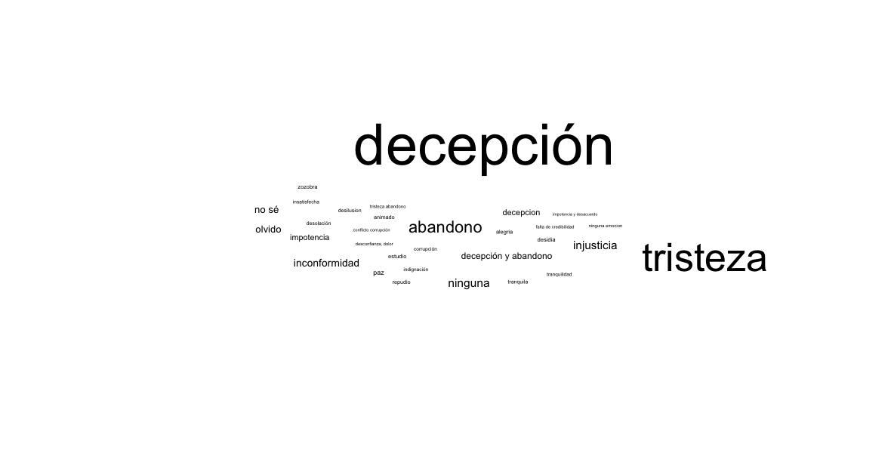

# Theory Construction 

Social scientists and researchers are usually tasked with developing and testing **theories** that explain certain patterns that exist in the social world.

Theories emerge out of questions that we have. Sometimes theories can be out of what some people call "me"search-- questions you have about your own lived experiences. Though, most likely, research questions emerge out of 3 potential puzzles you encounter about social life or existing research: 

1) Empirical Puzzle 

2) Theoretical Puzzle 

3) Methodological Puzzle 

# Where have you found motivation for previous projects? 

- What are some sources of inspiration you have had for other classes, or if you are applying to grad school, have a thesis, etc.? 

# Puzzle-Based Approach to Discovery, or Finding Motivation for Research Questions\footnote{Christopher Day \& Kendra L. Koivu (2019) Finding the Question: A Puzzle-Based Approach to the Logic of Discovery, \textit{Journal of Political Science Education}, 15:3, 377-386, DOI: 10.1080/15512169.2018.1493594}

- Distinction between *questions* and *interests*: 
  - Yes/No Questions (limited leverage for developing an explanation)
  - Questions with a Normative Basis (these are fine but our first base needs to be some sort of understanding of the underlying relationship -- otherwise we can't make evidence-based normative claims)
  - Questions with an implied hypothesis (the question guides itself into a certain proposition)
  
# So what do we need to do instead? 

- Most of what we see in science is not just based on some 'ah-hah' moment that gives us insight into a particular question. 

- Empahsis on a 'puzzle': ``perplexity over specific patterned outcomes" (Rosenau 1980); the question is then how to *identify* and *use* puzzles toward the end of developing research questions. 

# Empirical Puzzles 

- Some real-world event, cases of certain occurrences relative to others, likely most accessible if you have minimal theoretical knowledge. 

## **Contra Expectations Puzzle**: When some event in real life goes against theoretical expectations or conventional wisdom. 

- *Example*: What explains Trump's nomination to presidency in 2016? Given long-standing political wisdom and theory, we would have expected the "party [would] decide." 

# Empirical Puzzles 
 
## **Divergence/Convergence Puzzle**: Set of cases that don't relate to each other in an identifiable or expected way. 

- *Divergence*: multiple cases, or occurrences of given phenomena, that would otherwise be similar have different outcomes 
  
  - *Example*: Why have some regions throughout Mexico had difficulty in consolidating local democracy, while others have not? (Gibson 2012)
  
- *Convergence*: multiple cases that would otherwise be very different have the same outcomes 
  
  - *Example*: Although post-colonial African countries adopted very different ideologies of development at the outset, why did they all make a turn towards capitalism; why did the relative level of economic development remain uniform among them? (Young 1982)

# Empirical Puzzles 

## **Variation Over Time**: Some set of otherwise stable conditions suddenly change. 

- *Example*: For decades, revolutionary movements were unsuccessful in dismantling the landed elite class in El Salvador (Montgomery 1982). What explains the success of the FMLN in leading a successful democratic revolution in the late 20th century? 

# Theoretical Puzzles 

- Found in gaps or contradictions in existing academic literature, a little bit more difficult to discover if you have less familiarity with a body of work. 

## **Conceptual Omission**: Literature only addresses one type of phenomenon, but other types could exist. 

- **Example**: Classical political science describes the emergence and maintenance of one-party, military, or personalist authoritarian regimes. What explains the emergence of electoral or competitive authoritarianism? (Schedler 2002, Levitsky and Way 2002)

# Theoretical Puzzles 

## **Theoretical Convergence**: One body of literature weighs in on another body of literature

- *Example*: How does classical literature on state-building explain (or fail to explain) the emergence of rebel institutional structures in wartime? (Arjona 2016, Mampilly 2011)

# Theoretical Puzzles 

## **Squaring the circle**: Pit contradictory theoretical arguments against each other, identify alternative approach 

-**Example**: Existing evidence offers competing claims about the function of NGOs on undermining or supporting the quality of local democracy. What does additional evidence and more context have to say about this relationship? (Nelson-Nuñez 2018)

# Methodological Puzzles 

- Identify an ongoing issue where a method has not yet to be applied. Probably the most difficult of the puzzles to find and then to apply because they require the substantive knowledge *and* methodological knowledge. 

## **Measurement Puzzle**: Find a new way to measure a particularly difficult concept. 

- *Example*: Socioeconomic inequality measures are relatively uni-dimensional in the ways that they capture what it means to be unequal-- what alternatives do we have for measuring this? (García Montoya 2019) 

# Methodological Puzzles 

## **Technique Puzzle**: Resolve an issue by applying a new method 
- *Example*: How do we reconcile systematic review techniques when many scholars use many different ways to analyze the same phenomena? (Moore 2022)

# But then what do we do with our research questions? 

# Theory 

A **theory** is a proposition or set of propositions that explain a certain phenomenon in the world. Theories can be either *causal* or *descriptive*. 

Typically, a theory specifies a number of **concepts** of interest and explains the relationship between them. The way we define theoretical concepts depends on previous scientific work on that phenomenon and their manifestation in real life. 


# Theory Construction 

Empirical researchers evaluate whether or not theories are true through hypothesis testing. Hypothesis testing is a systematic method of discerning if observed evidence favors the developed theory or not.

In visualization-related tasks, our role is less concerned with testing theories, but rather illustrating the contours of a specific theory.

## Hypothesis and Null Hypothesis 

A **hypothesis** is an observation we would expect if a theory is true. 

A **null hypothesis** is the corresponding observation we would expect if the theory is *not* true. 

A hypothesis will usually specify the proposed nature of a relationship between two or more **variables**, which are the empirical stand-ins for theoretical concepts. These are the real world **things** that compose our theory. 

Unlikely that you'll need to remember this now, but good to know. 

# Theory Testing

To conduct hypothesis tests that help put our theory to the test, we need an empirical method to evaluate each hypothesis's veracity with collected data. A theory's contribution to knowledge and understanding of the world depends on how well the theory performs under these hypothesis tests. 

- Empirical methods can be either *qualitative* or *quantitative* in nature.

- Quantitative methods use numerical analyses to determine whether the accumulated evidence favors the hypothesis proposed or the null. Our default is to *favor the null*, and the burden is on the data to show otherwise. 

# Variables and their Functional Roles 

Theories explain why and how one variable varies depending on the character or value of another variable. This means we have a particular nomenclature to refer to variables given their functional role. 

- The **dependent variable** (Y) is the outcome of interest, whose value is expected to depend on some other variable. The dependent variable may also be referred to as the outcome or response variable.

- The **independent variable** (X) is the theorized cause of the dependent variable, or at least the cause of Y's variation. The value of the independent variable is expected to be independent of variation in Y.

# Theory Construction, An Example 

Let's say we have a theory that public approval of politicians is not grounded only in their present political careers. Instead, we conjecture that politician approval is also dependent on their social networks preceding their political careers. Specifically, we expect that politicians with previously public lives receive higher levels of public approval through their political term than those who did not have public lives prior. 

>- What is a hypothesis that we can derive from this theory? 

>- What variables constitute the hypothesis? 

>- What kind of data do you forsee being useful to *visualizing* this relationship? 

# Operationalization 

Adequately exploring, building, and testing theories requires that we think of real-world ways to measure the variables of interest.

For example, we might be abstractly interested in *socioeconomic inequality.* But, there are **many** ways to measure this concept.

Therefore, when we think of **operationalizing** socioeconomic inequality, we need to choose a fixed, systematic measure of this concept to help us identify instances of socioeconomic inequality. 

All quarter long we have either been implicitly choosing to operationalize certain social concepts as a certain measurable datapoint *or* we have worked with variables that are certain theoretical operationalizations of some big concepts (think, VDem). 

# Questions on this stuff??? 

# Visualizing Qualitative Data

- Not so simple. 

- Plus qualitative data is hard to get because of privacy concerns. OR if it's retrieved via an API, difficult to share because of different ToS on different platforms. 

# Visualizing Qualitative Data, Example

Example of what we can do without learning a whole new setup of data generation:

```{r state_cloud_graph, echo=FALSE, out.width="100%", out.height= "80%"}

```
